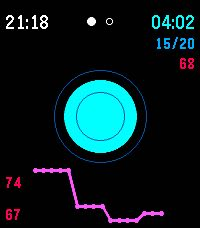

# Box Breathing

A calm little Pebble watchapp that guides you through paced breathing — inhale, hold, exhale, hold — so you can close your eyes and just breathe. Seven techniques are built in; pick one with the middle button long press.

  

## Controls

- **Top button** — pause / resume (short press) · reset session (long press)
- **Middle button** — cycle vibration mode (every second → phase only → off)
- **Middle button (long press)** — cycle breathing technique (classic 4-4-4-4 → beginner 3-3-3-3 → extended 5-5-5-5 → meditation 6-6-6-6 → advanced 8-8-8-8 → extended exhale 4-4-6-4 → 4-7-8)
- **Bottom button** — cycle display mode (default → always-on backlight → minimal → battery saver)

Your vibration mode, breathing technique, and display choice are remembered between launches.

## Techniques

| Technique       | Pattern   | Total |
|-----------------|-----------|-------|
| Classic         | 4-4-4-4   | 16 s  |
| Beginner        | 3-3-3-3   | 12 s  |
| Extended        | 5-5-5-5   | 20 s  |
| Meditation      | 6-6-6-6   | 24 s  |
| Advanced        | 8-8-8-8   | 32 s  |
| Extended exhale | 4-4-6-4   | 18 s  |
| 4-7-8           | 4-7-8     | 19 s  |

The current technique is shown under the clock as `X-X-X-X`, with a dot under the digit of the active phase.

## Get it

[apps.rePebble.com](https://apps.rePebble.com/2ac1cc737a7048d19b242a09)

## License

[GPLv3](LICENSE)
